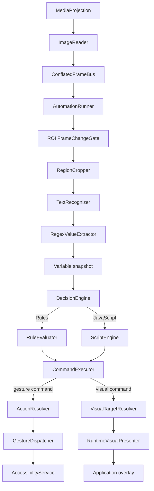

# Architecture

## Goals

TapScript is designed around five constraints:

1. **Android-first**: use native APIs directly where the platform is the product surface.
2. **Fast feedback**: avoid full-screen OCR and avoid processing stale frames.
3. **Replaceable components**: recognition, scripting, storage, gestures, and runtime presentation are ports.
4. **Small responsibilities**: orchestration classes coordinate; they do not implement OCR, parsing, persistence, Android gestures, or overlay rendering themselves.
5. **Safe scripting boundary**: user scripts produce semantic commands instead of receiving raw Android objects.

## Runtime flow



The decision layer therefore does not care whether the result is destructive (`tap`) or advisory (`highlight` / `showInfo`). Both are semantic commands with platform-specific execution behind ports.

## Module dependency direction

```text
engine-api
   ↑    ↑       ↑        ↑
   │    │       │        │
engine-core  recognition-mlkit  scripting-rhino  platform-android
   ↑             ↑               ↑                 ↑
   └─────────────┴───────────────┴─────────────────┘
                         app
                         ↑
                     storage-json
```

The practical dependency graph in Gradle is acyclic:

- `engine-core` → `engine-api`
- `platform-android` → `engine-api`
- `recognition-mlkit` → `engine-api`
- `scripting-rhino` → `engine-api`
- `storage-json` → `engine-api`
- `app` → all modules

`engine-api` contains Android `Bitmap` in the frame abstraction on purpose. TapScript is not pretending to be cross-platform; avoiding expensive conversion layers is more valuable than theoretical portability.

## Core abstractions

### ScreenFrameSource / ScreenFrameSink

The capture service publishes frames through a capacity-one conflated channel. Consumers never build a backlog. If OCR takes 80 ms while the screen produces 10 newer frames, superseded buffered frames are recycled and the runner receives the newest available one rather than processing stale frames. Once a frame is received, the runner owns and recycles it after processing.

### TextRecognizer

```kotlin
interface TextRecognizer {
    suspend fun recognize(bitmap: Bitmap): RecognizedText
}
```

ML Kit is one adapter. Tesseract, a custom TensorFlow Lite model, or a remote recognizer can be added without changing the runner.

### GestureDispatcher

The engine deals with pixel points and does not know about `AccessibilityService`.

### RuntimeVisualPresenter

Advisory UI is also behind a port. The command executor receives semantic visual commands and the app module renders them with a non-touchable Android overlay.

```kotlin
interface RuntimeVisualPresenter {
    suspend fun showHighlight(
        key: String,
        target: VisualTargetGeometry,
        label: String,
        tone: VisualTone,
    ): Result<Unit>

    suspend fun showInfo(
        key: String,
        title: String,
        body: String,
        tone: VisualTone,
    ): Result<Unit>

    suspend fun clear(key: String): Result<Unit>
    suspend fun clearAll(): Result<Unit>
}
```

`VisualTargetResolver` belongs in `engine-core`: it resolves a named recognition region or action into normalized geometry without depending on `WindowManager`. The Android overlay renderer stays in `app`, where framework ownership belongs.

Visual commands use stable keys so repeated script evaluations update one logical visual rather than allocating a new overlay element each time.

### ScriptEngine

Scripts receive plain values and emit a list of `AutomationCommand` objects. They do not get a `Context`, service instance, filesystem handle, network client, or reflection-friendly application object.

The current Rhino API includes gesture/timing commands plus advisory commands:

```text
tap / tapRandom
swipe / swipeRandom
waitMs / waitRandom
log
highlight / showInfo / clearVisual / clearVisuals
```

### ProfileRepository

Storage is independent from the editor. JSON is currently used because profiles should be inspectable/exportable. A Room or cloud implementation can replace it later.

## Runtime-visual lifecycle

Runtime advisory visuals are ephemeral session state, not profile state. They are cleared when:

- the profile is manually/system-paused;
- an app-scoped profile loses its target app;
- a script decision errors;
- the automation run stops or fails;
- TapScript shuts down.

Visual-only commands do not count as gestures for `postActionCooldownMs`.

Region outlines are deliberately rendered outside configured OCR rectangles. Because MediaProjection can capture application overlays, painting inside an OCR ROI could alter recognized pixels or repeatedly trip ROI change detection. Keeping the outline outside the watched content avoids that feedback path while still making the region obvious to the user.

## Android framework boundaries

Framework-created components (`Service`, `AccessibilityService`) cannot be constructor-injected normally. TapScript keeps the workaround narrow:

- the `Application` implements a small dependency-provider interface for the capture service;
- the accessibility service registers its live instance in `AccessibilityServiceRegistry`;
- the rest of the code receives normal constructor dependencies.

This isolates service-location to the Android lifecycle boundary rather than leaking it throughout the codebase.

Overlay renderers use `TYPE_APPLICATION_OVERLAY` and stay non-focusable/non-touchable when they are purely advisory. Overlay-hosted editor UI must avoid child-window APIs that require an Activity token.

## Threading

- MediaProjection callbacks: dedicated `HandlerThread`.
- OCR and engine work: `Dispatchers.Default` / ML Kit task suspension.
- profile IO: `Dispatchers.IO`.
- Compose: main thread.
- gesture dispatch: Android accessibility service/main looper as required.
- `WindowManager` runtime-visual mutations: `Dispatchers.Main.immediate`.

## Failure model

A recognition failure does not stop the session. It is logged as an observation error and the next frame can recover. A script syntax/runtime error emits no decision commands and clears stale advisory visuals instead of leaving an old recommendation visible. Missing gesture targets remain explicit command-execution failures; a missing/ambiguous visual target is logged and skipped without crashing gesture execution.
