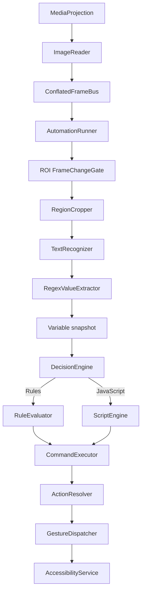

# Architecture

## Goals

TapScript is designed around five constraints:

1. **Android-first**: use native APIs directly where the platform is the product surface.
2. **Fast feedback**: avoid full-screen OCR and avoid processing stale frames.
3. **Replaceable components**: recognition, scripting, storage, and gestures are ports.
4. **Small responsibilities**: orchestration classes coordinate; they do not implement OCR, parsing, persistence, or Android gestures themselves.
5. **Safe scripting boundary**: user scripts produce commands instead of receiving raw Android objects.

## Runtime flow



## Module dependency direction

```text
engine-api
   ↑    ↑       ↑        ↑
   │    │       │        │
engine-core  recognition-mlkit  scripting-rhino  platform-android
   ↑             ↑               ↑                 ↑
   └─────────────┴───────────────┴─────────────────┘
                         app
                         ↑
                     storage-json
```

The practical dependency graph in Gradle is acyclic:

- `engine-core` → `engine-api`
- `platform-android` → `engine-api`
- `recognition-mlkit` → `engine-api`
- `scripting-rhino` → `engine-api`
- `storage-json` → `engine-api`
- `app` → all modules

`engine-api` contains Android `Bitmap` in the frame abstraction on purpose. TapScript is not pretending to be cross-platform; avoiding expensive conversion layers is more valuable than theoretical portability.

## Core abstractions

### ScreenFrameSource / ScreenFrameSink

The capture service publishes frames through a capacity-one conflated channel. Consumers never build a backlog. If OCR takes 80 ms while the screen produces 10 newer frames, superseded buffered frames are recycled and the runner receives the newest available one rather than processing stale frames. Once a frame is received, the runner owns and recycles it after processing.

### TextRecognizer

```kotlin
interface TextRecognizer {
    suspend fun recognize(bitmap: Bitmap): RecognizedText
}
```

ML Kit is one adapter. Tesseract, a custom TensorFlow Lite model, or a remote recognizer can be added without changing the runner.

### GestureDispatcher

The engine deals with pixel points and does not know about `AccessibilityService`.

### ScriptEngine

Scripts receive plain values and emit a list of `AutomationCommand` objects. They do not get a `Context`, service instance, filesystem handle, or reflection-friendly application object.

### ProfileRepository

Storage is independent from the editor. JSON is currently used because profiles should be inspectable/exportable. A Room or cloud implementation can replace it later.

## Android framework boundaries

Framework-created components (`Service`, `AccessibilityService`) cannot be constructor-injected normally. TapScript keeps the workaround narrow:

- the `Application` implements a small dependency-provider interface for the capture service;
- the accessibility service registers its live instance in `AccessibilityServiceRegistry`;
- the rest of the code receives normal constructor dependencies.

This isolates service-location to the Android lifecycle boundary rather than leaking it throughout the codebase.

## Threading

- MediaProjection callbacks: dedicated `HandlerThread`.
- OCR and engine work: `Dispatchers.Default` / ML Kit task suspension.
- profile IO: `Dispatchers.IO`.
- Compose: main thread.
- gesture dispatch: Android accessibility service/main looper as required.

## Failure model

A recognition failure does not stop the session. It is logged as an observation error and the next frame can recover. A script syntax/runtime error pauses command emission but does not crash the foreground capture service. Missing action targets are explicit command-execution failures.
